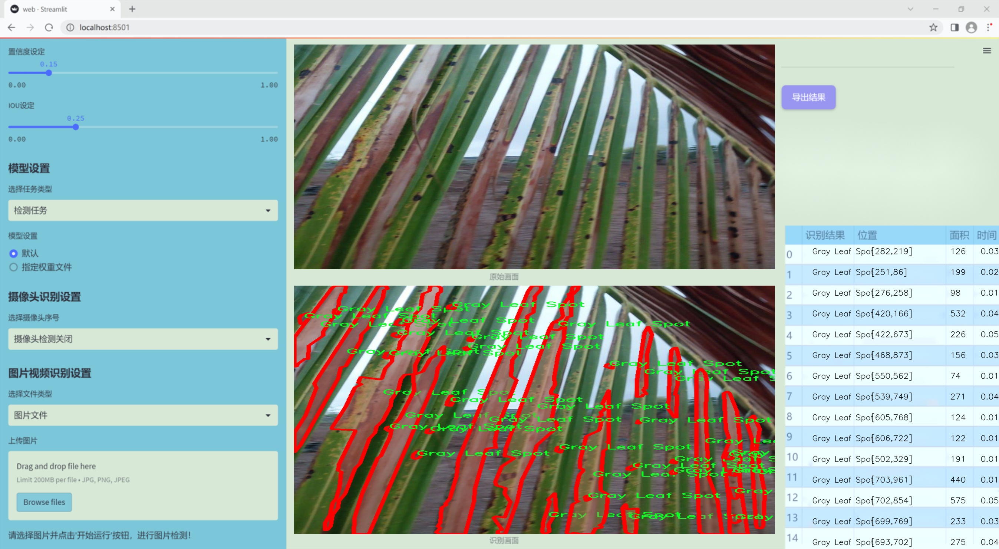
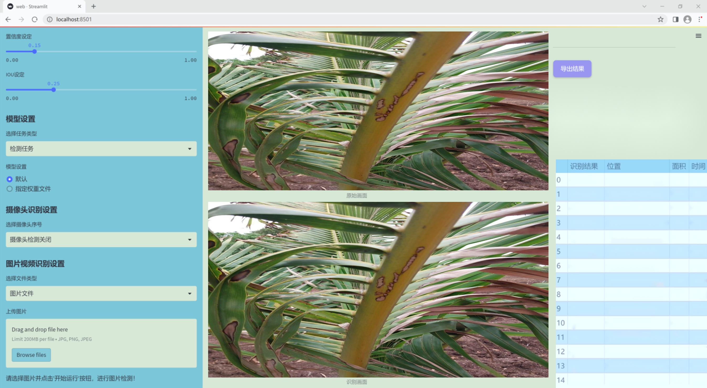
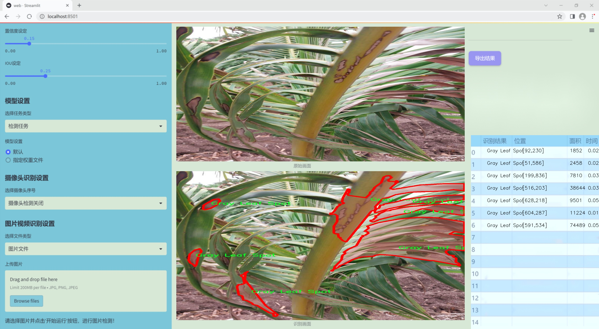
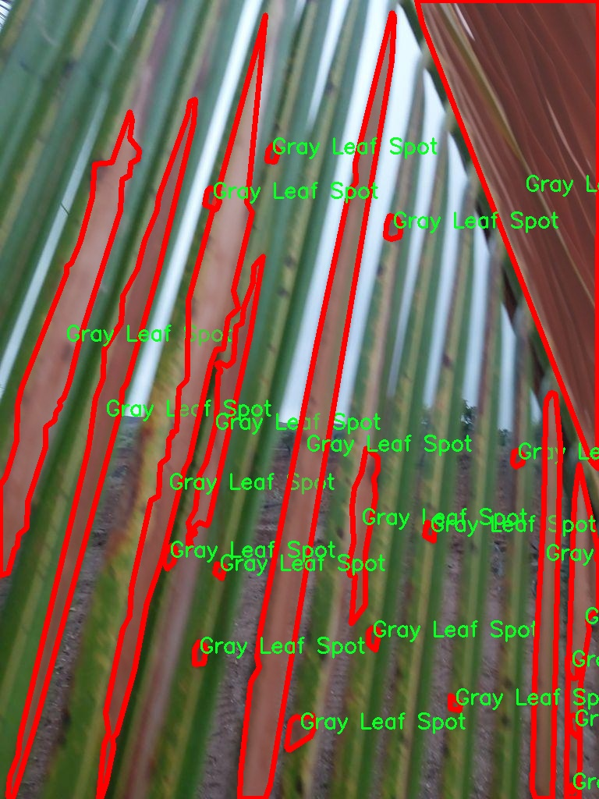
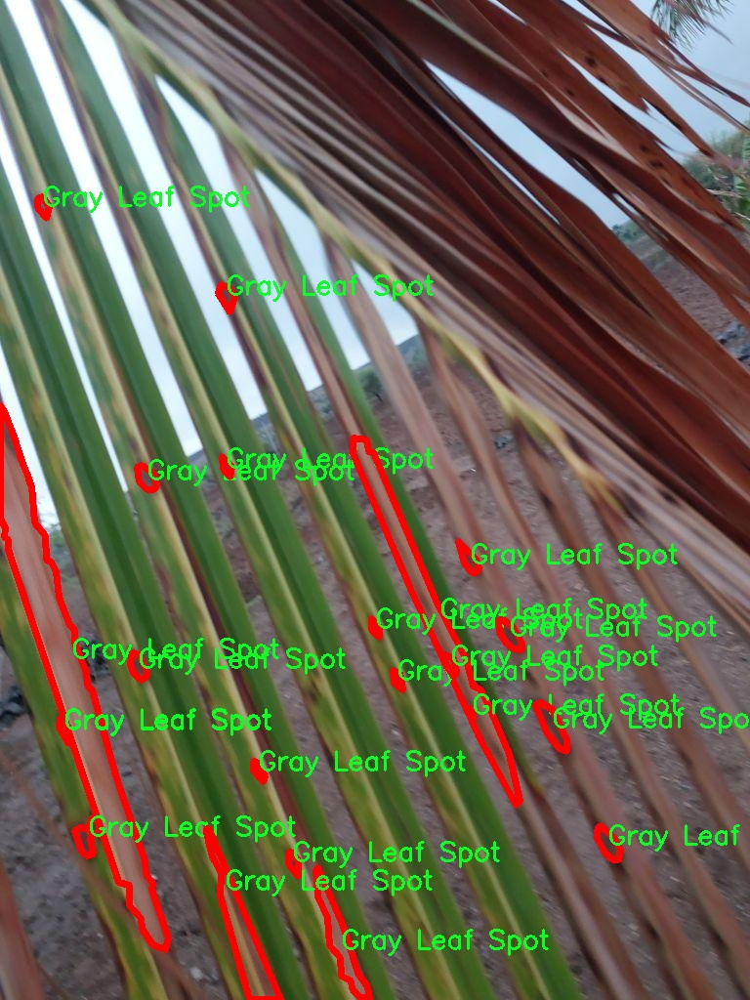
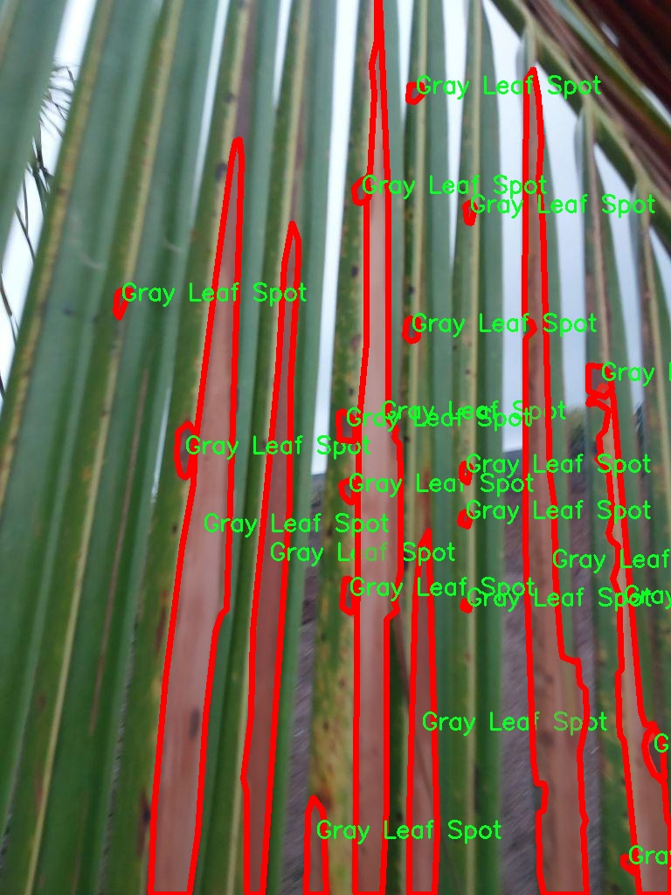
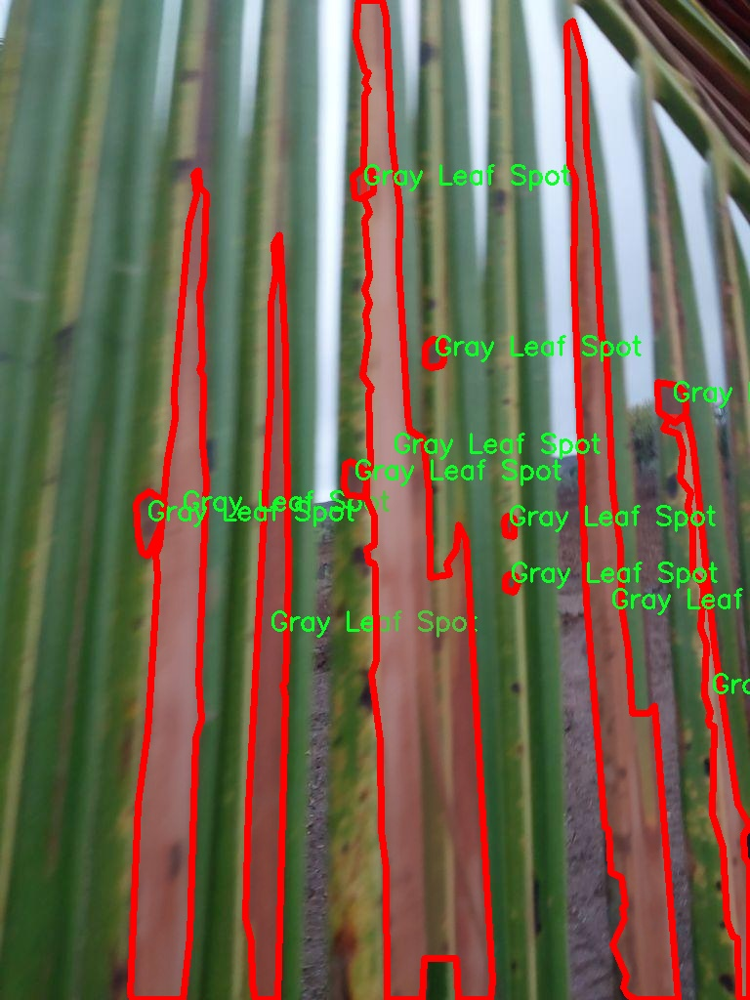
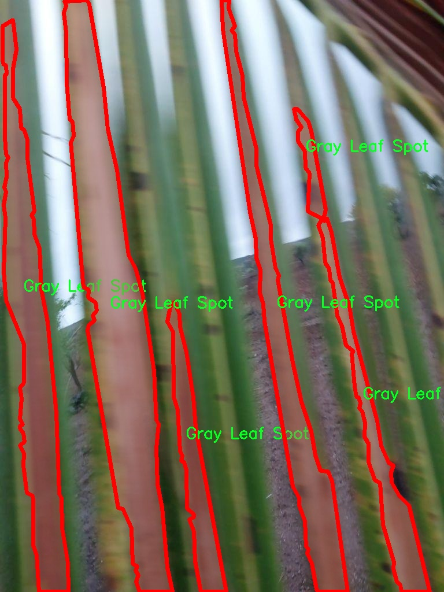

### 1.背景意义

研究背景与意义

随着全球气候变化和农业生产方式的转变，植物病害的发生频率和种类日益增加，给农业生产带来了严峻的挑战。植物病害不仅影响作物的生长和产量，还可能导致经济损失和食品安全问题。因此，开发高效、准确的植物病害检测系统显得尤为重要。近年来，深度学习技术在计算机视觉领域取得了显著进展，尤其是目标检测和图像分割方面的应用，为植物病害的自动识别提供了新的解决方案。

YOLO（You Only Look Once）系列模型因其高效的实时检测能力和较好的检测精度，成为了植物病害检测研究中的热门选择。YOLOv11作为该系列的最新版本，结合了更为先进的网络结构和优化算法，能够在复杂背景下实现更高的检测精度和速度。通过对YOLOv11的改进，我们可以进一步提升其在植物病害检测中的表现，尤其是在对不同病害类型的准确识别和分类方面。

本研究将基于CocoAID数据集，重点关注“灰叶斑”和“叶腐病”这两种常见的植物病害。该数据集包含3710张经过标注的图像，涵盖了多种植物病害的表现特征，为模型的训练和评估提供了丰富的样本。通过对YOLOv11的改进，我们旨在提高模型对这两种病害的检测能力，从而为农业生产提供有效的技术支持。

此外，植物病害的早期检测和准确识别不仅能够帮助农民及时采取防治措施，还能为农业管理提供数据支持，推动精准农业的发展。因此，基于改进YOLOv11的植物病害检测系统的研究，不仅具有重要的学术价值，也对实际农业生产具有深远的影响。通过这一研究，我们希望能够为植物病害的监测和管理提供新的思路和方法，促进农业的可持续发展。

### 2.视频效果

[2.1 视频效果](https://www.bilibili.com/video/BV13Zq3YWEZh/)

### 3.图片效果







##### [项目涉及的源码数据来源链接](https://kdocs.cn/l/cszuIiCKVNis)**

注意：本项目提供训练的数据集和训练教程,由于版本持续更新,暂不提供权重文件（best.pt）,请按照6.训练教程进行训练后实现上图演示的效果。

### 4.数据集信息

##### 4.1 本项目数据集类别数＆类别名

nc: 2
names: ['Gray Leaf Spot', 'Leaf Rot']


该项目为【图像分割】数据集，请在【训练教程和Web端加载模型教程（第三步）】这一步的时候按照【图像分割】部分的教程来训练

##### 4.2 本项目数据集信息介绍

本项目数据集信息介绍

本项目所使用的数据集旨在支持改进YOLOv11的植物病害检测系统，专注于植物叶片病害的识别与分类。数据集的主题围绕“CocoAID Model”构建，专注于两种主要的植物病害类型：灰叶斑病（Gray Leaf Spot）和叶腐病（Leaf Rot）。这两种病害在农业生产中具有广泛的影响，能够显著降低作物的产量和质量，因此对其进行准确的检测和分类显得尤为重要。

数据集中包含丰富的图像样本，涵盖了不同生长阶段、不同光照条件和不同病害严重程度的植物叶片。这些样本不仅提供了多样化的视觉信息，还考虑到了自然环境中植物的多样性，使得模型在实际应用中能够具备更强的适应性和鲁棒性。每个样本都经过精心标注，确保在训练过程中能够有效地学习到病害的特征和模式。

通过使用该数据集，改进后的YOLOv11模型将能够在更短的时间内实现高效的病害检测，并提高检测的准确率。这对于农民和农业工作者来说，能够及时发现病害并采取相应的防治措施，从而有效减少经济损失。此外，数据集的设计也为后续的研究提供了基础，促进了植物病害检测领域的进一步发展。

总之，本项目的数据集不仅是对YOLOv11模型的有力支持，也是推动农业智能化和精准化的重要一步，期待其在实际应用中能够发挥出更大的价值。











### 5.全套项目环境部署视频教程（零基础手把手教学）

[5.1 所需软件PyCharm和Anaconda安装教程（第一步）](https://www.bilibili.com/video/BV1BoC1YCEKi/?spm_id_from=333.999.0.0&vd_source=bc9aec86d164b67a7004b996143742dc)


[5.2 安装Python虚拟环境创建和依赖库安装视频教程（第二步）](https://www.bilibili.com/video/BV1ZoC1YCEBw?spm_id_from=333.788.videopod.sections&vd_source=bc9aec86d164b67a7004b996143742dc)

### 6.改进YOLOv11训练教程和Web_UI前端加载模型教程（零基础手把手教学）

[6.1 改进YOLOv11训练教程和Web_UI前端加载模型教程（第三步）](https://www.bilibili.com/video/BV1BoC1YCEhR?spm_id_from=333.788.videopod.sections&vd_source=bc9aec86d164b67a7004b996143742dc)


按照上面的训练视频教程链接加载项目提供的数据集，运行train.py即可开始训练



     Epoch   gpu_mem       box       obj       cls    labels  img_size
     1/200     20.8G   0.01576   0.01955  0.007536        22      1280: 100%|██████████| 849/849 [14:42<00:00,  1.04s/it]
               Class     Images     Labels          P          R     mAP@.5 mAP@.5:.95: 100%|██████████| 213/213 [01:14<00:00,  2.87it/s]
                 all       3395      17314      0.994      0.957      0.0957      0.0843

     Epoch   gpu_mem       box       obj       cls    labels  img_size
     2/200     20.8G   0.01578   0.01923  0.007006        22      1280: 100%|██████████| 849/849 [14:44<00:00,  1.04s/it]
               Class     Images     Labels          P          R     mAP@.5 mAP@.5:.95: 100%|██████████| 213/213 [01:12<00:00,  2.95it/s]
                 all       3395      17314      0.996      0.956      0.0957      0.0845

     Epoch   gpu_mem       box       obj       cls    labels  img_size
     3/200     20.8G   0.01561    0.0191  0.006895        27      1280: 100%|██████████| 849/849 [10:56<00:00,  1.29it/s]
               Class     Images     Labels          P          R     mAP@.5 mAP@.5:.95: 100%|███████   | 187/213 [00:52<00:00,  4.04it/s]
                 all       3395      17314      0.996      0.957      0.0957      0.0845


###### [项目数据集下载链接](https://kdocs.cn/l/cszuIiCKVNis)

### 7.原始YOLOv11算法讲解

YOLO11采用改进的骨干和颈部架构，增强了特征提取能力，提高了物体检测的精确度和复杂任务的表现。YOLO11引入精炼的架构设计和优化的训练流程，实现更快的处理速度，同时保持精度和性能之间的最佳平衡。通过模型设计的进步，YOLO11m在COCO数据集上实现了更高的均值平均精度（mAP），同时使用比YOLOv8m少22%的参数，使其在不妥协准确性的情况下更加计算高效。YOLO11可以无缝部署在各种环境中，包括边缘设备、云平台以及支持NVIDIA
GPU的系统，确保最大灵活性。无论是物体检测、实例分割、图像分类、姿态估计，还是定向物体检测（OBB），YOLO11都旨在应对多样的计算机视觉挑战。


##### **Ultralytics YOLO11相比于之前版本的主要改进有哪些？**

Ultralytics YOLO11在其前身基础上引入了几项重要进步。主要改进包括：

  1. **增强的特征提取** ：YOLO11采用改进的骨干和颈部架构，增强了特征提取能力，提高了物体检测的精确度。
  2.  **优化的效率和速度** ：精炼的架构设计和优化的训练流程实现了更快的处理速度，同时保持了准确性和性能之间的平衡。
  3.  **更高的准确性与更少的参数** ：YOLO11m在COCO数据集上实现了更高的均值平均精度（mAP），同时使用比YOLOv8m少22%的参数，使其在不妥协准确性的情况下更加计算高效。
  4.  **环境适应性强** ：YOLO11可以在多种环境中部署，包括边缘设备、云平台以及支持NVIDIA GPU的系统。
  5.  **支持广泛的任务** ：YOLO11支持多种计算机视觉任务，如物体检测、实例分割、图像分类、姿态估计和定向物体检测（OBB）。

我们先来看一下其网络结构有什么变化，可以看出，相比较于YOLOv8模型，其将CF2模块改成C3K2，同时在SPPF模块后面添加了一个C2PSA模块，且将YOLOv10的head思想引入到YOLO11的head中，使用深度可分离的方法，减少冗余计算，提高效率。下面我们来详细看一下这两个模块的结构是怎么构成的，以及它们为什么要这样设计


##### C3K2的网络结构

从下面图中我们可以看到，C3K2模块其实就是C2F模块转变出来的，它代码中有一个设置，就是当c3k这个参数为FALSE的时候，C3K2模块就是C2F模块，也就是说它的Bottleneck是普通的Bottleneck；反之当它为true的时候，将Bottleneck模块替换成C3模块。


##### C2PSA的网络结构

` `C2PSA是对 `C2f` 模块的扩展，它结合了PSA(Pointwise Spatial
Attention)块，用于增强特征提取和注意力机制。通过在标准 `C2f` 模块中引入 PSA
块，C2PSA实现了更强大的注意力机制，从而提高了模型对重要特征的捕捉能力。


##### **C2f 模块回顾：**

**** C2f模块是一个更快的 CSP（Cross Stage Partial）瓶颈实现，它通过两个卷积层和多个 Bottleneck
块进行特征提取。相比传统的 CSPNet，C2f 优化了瓶颈层的结构，使得计算速度更快。在 C2f中，`cv1` 是第一个 1x1
卷积，用于减少通道数；`cv2` 是另一个 1x1 卷积，用于恢复输出通道数。而 `n` 是一个包含 Bottleneck 块的数量，用于提取特征。

##### **C2PSA 模块的增强** ：

**C2PSA** 扩展了 C2f，通过引入PSA( **Position-Sensitive Attention)**
，旨在通过多头注意力机制和前馈神经网络来增强特征提取能力。它可以选择性地添加残差结构（shortcut）以优化梯度传播和网络训练效果。同时，使用FFN
可以将输入特征映射到更高维的空间，捕获输入特征的复杂非线性关系，允许模型学习更丰富的特征表示。

##### head部分

YOLO11在head部分的cls分支上使用深度可分离卷积 ，具体代码如下，cv2边界框回归分支，cv3分类分支。

    
    
     self.cv2 = nn.ModuleList(
                nn.Sequential(Conv(x, c2, 3), Conv(c2, c2, 3), nn.Conv2d(c2, 4 * self.reg_max, 1)) for x in ch
            )
            self.cv3 = nn.ModuleList(
                nn.Sequential(
                    nn.Sequential(DWConv(x, x, 3), Conv(x, c3, 1)),
                    nn.Sequential(DWConv(c3, c3, 3), Conv(c3, c3, 1)),
                    nn.Conv2d(c3, self.nc, 1),
                )
                for x in ch
            )


### 8.200+种全套改进YOLOV11创新点原理讲解

#### 8.1 200+种全套改进YOLOV11创新点原理讲解大全

由于篇幅限制，每个创新点的具体原理讲解就不全部展开，具体见下列网址中的改进模块对应项目的技术原理博客网址【Blog】（创新点均为模块化搭建，原理适配YOLOv5~YOLOv11等各种版本）

[改进模块技术原理博客【Blog】网址链接](https://gitee.com/qunmasj/good)


#### 8.2 精选部分改进YOLOV11创新点原理讲解

###### 这里节选部分改进创新点展开原理讲解(完整的改进原理见上图和[改进模块技术原理博客链接](https://gitee.com/qunmasj/good)【如果此小节的图加载失败可以通过CSDN或者Github搜索该博客的标题访问原始博客，原始博客图片显示正常】

### 高效网络架构 CloAtt简介
众所周知，自从 ViTs 提出后，Transformer 基本横扫各大 CV 主流任务，包括视觉识别、目标检测和语义分割等。然而，一个比较棘手的问题就是这个架构参数量和计算量太大，所以一直被广受诟病。因此，后续有不少工作都是朝着这个方向去改进，例如 Swin-Transformer 在局部非重叠窗口中进行注意力计算，而 PVT 中则是使用平均池化来合并 token 以进一步压缩耗时。然而，这些 ViTs 由于其参数量太大以及高 FLOPs 并不适合部署到移动设备。如果我们直接缩小到适合移动设备的尺寸时，它们的性能又会显著降低。


#### MobileViT
因此，出现了不少工作聚焦于探索轻量级的视觉变换器，使 ViTs 适用于移动设备，CVHub 此前也介绍过不少的工作，大家有兴趣可以翻阅历史文章读读。例如，苹果团队提出的 MobileViT 研究了如何将 CNN 与 Transformer 相结合，而另一个工作 MobileFormer 则将轻量级的 MobileNet 与 Transformer 进行融合。此外，最新提出的 EdgeViT 提出了一个局部-全局-局部模块来聚合信息。以上工作的目标都是设计具有高性能、较少参数和低 FLOPs 的移动端友好型模型。


#### EdgeViT
然而，作者从频域编码的角度认为，在现有的轻量级模型中，大多数方法只关注设计稀疏注意力，以有效地处理低频全局信息，而使用相对简单的方法处理高频局部信息。具体而言，大多数模型如 EdgeViT 和 MobileViT，只是简单使用原始卷积提取局部表示，这些方法仅使用卷积中的全局共享权重处理高频本地信息。其他方法，如 LVT ，则是首先将标记展开到窗口中，然后使用窗口内的注意力获得高频信息。这些方法仅使用特定于每个 Token 的上下文感知权重进行局部感知。


#### LVT
虽然上述轻量级模型在多个数据集上取得了良好的结果，但没有一种方法尝试设计更有效的方法，即利用共享和上下文感知权重的优势来处理高频局部信息。基于共享权重的方法，如传统的卷积神经网络，具有平移等变性的特征。与它们不同，基于上下文感知权重的方法，如 LVT 和 NAT，具有可以随输入内容变化的权重。这两种类型的权重在局部感知中都有自己的优势。
#### NAT


受该博客的启发，本文设计了一种轻量级视觉变换器——CloAtt，其利用了上下文感知的局部增强。特别地，CloAtt 采用了双分支设计结构。
#### 局部分支
在局部分支中，本文引入了一个精心设计的 AttnConv，一种简单而有效的卷积操作符，它采用了注意力机制的风格。所提出的 AttnConv 有效地融合了共享权重和上下文感知权重，以聚合高频的局部信息。具体地，AttnConv 首先使用深度卷积（DWconv）提取局部表示，其中 DWconv 具有共享权重。然后，其使用上下文感知权重来增强局部特征。与 Non-Local 等生成上下文感知权重的方法不同，AttnConv 使用门控机制生成上下文感知权重，引入了比常用的注意力机制更强的非线性。此外，AttnConv 将卷积算子应用于 Query 和 Key 以聚合局部信息，然后计算 Q 和 K 的哈达玛积，并对结果进行一系列线性或非线性变换，生成范围在 [-1,1] 之间的上下文感知权重。值得注意的是，AttnConv 继承了卷积的平移等变性，因为它的所有操作都基于卷积。
#### 全局分支
在全局分支中则使用了传统的注意力机制，但对 K 和 V 进行了下采样以减少计算量，从而捕捉低频全局信息。最后，CloFormer 通过简单的方法将局部分支和全局分支的输出进行融合，从而使模型能够同时捕捉高频和低频信息。总的来说，CloFormer 的设计能够同时发挥共享权重和上下文感知权重的优势，提高其局部感知的能力，使其在图像分类、物体检测和语义分割等多个视觉任务上均取得了优异的性能。
如上图2所示，CloFormer 共包含一个卷积主干和四个 stage，每个 stage you Clo 模块 和 ConvFFN 组合而成的模块堆叠而成 。具体得，首先将输入图像通过卷积主干传递，以获取 token 表示。该主干由四个卷积组成，每个卷积的步长依次为2、2、1和1。接下来，tokens 经历四个 Clo 块和 ConvFFN 阶段，以提取分层特征。最后，再利用全局平均池化和全连接层生成预测结果。可以看出，整个架构非常简洁，支持即插即用！


#### ConvFFN
为了将局部信息融入 FFN 过程中，本文采用 ConvFFN 替换了常用的 FFN。ConvFFN 和常用的 FFN 的主要区别在于，ConvFFN 在 GELU 激活函数之后使用了深度卷积（DWconv），从而使 ConvFFN 能够聚合局部信息。由于DWconv 的存在，可以直接在 ConvFFN 中进行下采样而不需要引入 PatchMerge 模块。CloFormer 使用了两种ConvFFN。第一种是在阶段内的 ConvFFN，它直接利用跳跃连接。另一种是连接两个阶段的 ConvFFN，主要用于下采样操作。
#### Clo block
CloFormer 中的 Clo块 是非常关键的组件。每个 Clo 块由一个局部分支和一个全局分支组成。在全局分支中，我们首先下采样 K 和 V，然后对 Q、K 和 V 进行标准的 attention 操作，以提取低频全局信息。
虽然全局分支的设计能够有效减少注意力机制所需的浮点运算次数，并且能够获得全局的感受野。然而，它在处理高频局部信息方面的能力不足。为了解决这个问题，CloFormer 引入了局部分支，并使用 AttnConv 对高频局部信息进行处理。AttnConv 可以融合共享权重和上下文感知权重，能够更好地处理高频局部信息。因此，CloFormer 结合了全局和局部的优势来提高图像分类性能。下面我们重点讲下 AttnConv 。
#### AttnConv
AttnConv 是一个关键模块，使得所提模型能够获得高性能。它结合了一些标准的 attention 操作。具体而言，在AttnConv 中，我们首先进行线性变换以获得 Q、K和V。在进行线性变换之后，我们再对 V 进行共享权重的局部特征聚合。然后，基于处理后的 V 和 Q ，K 进行上下文感知的局部增强。具体流程可对照流程图理解，我们可以将其拆解成三个步骤。
#### Local Feature Aggregation
为了简单起见，本文直接使用一个简单的深度卷积（DWconv）来对 V 进行局部信息聚合。
#### Context-aware Local Enhancement
在将具有共享权重的局部信息整合到 V 中后，我们结合 Q 和 K 生成上下文感知权重。值得注意的是，我们使用了与局部自注意力不同的方法，该方法更加简洁。具体而言，我们首先使用两个 DWconv 对 Q 和 K 分别进行局部信息聚合。然后，我们计算 Q 和 K 的 Hadamard 乘积，并对结果进行一系列转换，以获取在 -1 到 1 之间的上下文感知权重。最后，我们使用生成的权重来增强局部特征。
#### Fusion with Global Branch
在整个 CloFormer 中，我们使用一种简单直接的方法来将局部分支和全局分支的输出进行融合。具体而言，本文是通过将这两个输出在通道维度上进行直接拼接，然后再通过一个 FC 层聚合这些特征并结合残差输出。
最后，上图展示了三种不同的方法。相比于传统卷积，AttnConv 中的上下文感知权重使得模型能够更好地适应输入内容。相比于局部自注意力机制，引入共享权重使得模型能够更好地处理高频信息，从而提高性能。此外，生成上下文感知权重的方法引入了更强的非线性性，也提高了性能。需要注意的是，AttnConv 中的所有操作都基于卷积，保持了卷积的平移等变性特性。


### 9.系统功能展示

图9.1.系统支持检测结果表格显示

  图9.2.系统支持置信度和IOU阈值手动调节

  图9.3.系统支持自定义加载权重文件best.pt(需要你通过步骤5中训练获得)

  图9.4.系统支持摄像头实时识别

  图9.5.系统支持图片识别

  图9.6.系统支持视频识别

  图9.7.系统支持识别结果文件自动保存

  图9.8.系统支持Excel导出检测结果数据


### 10. YOLOv11核心改进源码讲解

#### 10.1 kaln_conv.py

以下是对代码的核心部分进行提炼和详细注释的结果：

```python
from functools import lru_cache
import torch
import torch.nn as nn
from torch.nn.functional import conv3d, conv2d, conv1d

class KALNConvNDLayer(nn.Module):
    def __init__(self, conv_class, norm_class, conv_w_fun, input_dim, output_dim, degree, kernel_size,
                 groups=1, padding=0, stride=1, dilation=1, dropout: float = 0.0, ndim: int = 2):
        super(KALNConvNDLayer, self).__init__()
        
        # 初始化参数
        self.inputdim = input_dim  # 输入维度
        self.outdim = output_dim    # 输出维度
        self.degree = degree         # 多项式的阶数
        self.kernel_size = kernel_size  # 卷积核大小
        self.padding = padding       # 填充
        self.stride = stride         # 步幅
        self.dilation = dilation     # 膨胀
        self.groups = groups         # 分组卷积的组数
        self.base_activation = nn.SiLU()  # 基础激活函数
        self.conv_w_fun = conv_w_fun  # 卷积权重函数
        self.ndim = ndim             # 数据的维度（1D, 2D, 3D）
        self.dropout = None          # Dropout层

        # 初始化Dropout层
        if dropout > 0:
            if ndim == 1:
                self.dropout = nn.Dropout1d(p=dropout)
            elif ndim == 2:
                self.dropout = nn.Dropout2d(p=dropout)
            elif ndim == 3:
                self.dropout = nn.Dropout3d(p=dropout)

        # 检查分组卷积的有效性
        if groups <= 0:
            raise ValueError('groups must be a positive integer')
        if input_dim % groups != 0:
            raise ValueError('input_dim must be divisible by groups')
        if output_dim % groups != 0:
            raise ValueError('output_dim must be divisible by groups')

        # 创建基础卷积层和归一化层
        self.base_conv = nn.ModuleList([conv_class(input_dim // groups,
                                                   output_dim // groups,
                                                   kernel_size,
                                                   stride,
                                                   padding,
                                                   dilation,
                                                   groups=1,
                                                   bias=False) for _ in range(groups)])

        self.layer_norm = nn.ModuleList([norm_class(output_dim // groups) for _ in range(groups)])

        # 初始化多项式权重
        poly_shape = (groups, output_dim // groups, (input_dim // groups) * (degree + 1)) + tuple(
            kernel_size for _ in range(ndim))
        self.poly_weights = nn.Parameter(torch.randn(*poly_shape))

        # 使用Kaiming均匀分布初始化卷积层和多项式权重
        for conv_layer in self.base_conv:
            nn.init.kaiming_uniform_(conv_layer.weight, nonlinearity='linear')
        nn.init.kaiming_uniform_(self.poly_weights, nonlinearity='linear')

    @lru_cache(maxsize=128)  # 使用LRU缓存以避免重复计算勒让德多项式
    def compute_legendre_polynomials(self, x, order):
        # 计算勒让德多项式
        P0 = x.new_ones(x.shape)  # P0 = 1
        if order == 0:
            return P0.unsqueeze(-1)
        P1 = x  # P1 = x
        legendre_polys = [P0, P1]

        # 使用递推关系计算高阶多项式
        for n in range(1, order):
            Pn = ((2.0 * n + 1.0) * x * legendre_polys[-1] - n * legendre_polys[-2]) / (n + 1.0)
            legendre_polys.append(Pn)

        return torch.cat(legendre_polys, dim=1)

    def forward_kal(self, x, group_index):
        # 前向传播函数，处理每个组的输入
        base_output = self.base_conv[group_index](x)  # 基础卷积输出

        # 将输入归一化到[-1, 1]范围
        x_normalized = 2 * (x - x.min()) / (x.max() - x.min()) - 1 if x.shape[0] > 0 else x

        # 应用Dropout
        if self.dropout is not None:
            x_normalized = self.dropout(x_normalized)

        # 计算勒让德多项式
        legendre_basis = self.compute_legendre_polynomials(x_normalized, self.degree)
        # 使用多项式权重进行卷积
        poly_output = self.conv_w_fun(legendre_basis, self.poly_weights[group_index],
                                      stride=self.stride, dilation=self.dilation,
                                      padding=self.padding, groups=1)

        # 合并基础输出和多项式输出
        x = base_output + poly_output
        # 归一化和激活
        if isinstance(self.layer_norm[group_index], nn.LayerNorm):
            orig_shape = x.shape
            x = self.layer_norm[group_index](x.view(orig_shape[0], -1)).view(orig_shape)
        else:
            x = self.layer_norm[group_index](x)
        x = self.base_activation(x)

        return x

    def forward(self, x):
        # 前向传播，处理所有组的输入
        split_x = torch.split(x, self.inputdim // self.groups, dim=1)
        output = []
        for group_ind, _x in enumerate(split_x):
            y = self.forward_kal(_x.clone(), group_ind)
            output.append(y.clone())
        y = torch.cat(output, dim=1)  # 合并所有组的输出
        return y
```

### 代码分析
1. **KALNConvNDLayer类**：这是一个通用的N维卷积层，支持多项式卷积。它可以处理1D、2D和3D数据，使用了分组卷积和归一化层。
2. **构造函数**：初始化输入和输出维度、卷积参数、Dropout层等，并检查参数的有效性。
3. **compute_legendre_polynomials方法**：计算勒让德多项式，使用递推关系生成多项式。
4. **forward_kal方法**：处理每个组的前向传播，包括基础卷积、归一化、激活和多项式卷积。
5. **forward方法**：处理整个输入，按组分割输入并调用`forward_kal`进行处理，最后合并输出。

这个类的设计允许灵活地构建具有多项式特性的卷积层，适用于各种维度的数据处理。

这个程序文件 `kaln_conv.py` 定义了一系列用于深度学习的卷积层，主要是 KALN（Kernel Adaptive Legendre Network）卷积层，支持一维、二维和三维卷积。代码使用了 PyTorch 框架，并通过继承和模块化的方式实现了不同维度的卷积层。

首先，`KALNConvNDLayer` 类是一个通用的卷积层基类，支持任意维度的卷积。构造函数中接受多个参数，包括卷积类型、归一化类型、输入和输出维度、卷积核大小、组数、填充、步幅、扩张率、丢弃率等。该类通过 `nn.ModuleList` 来管理多个卷积层和归一化层，以支持分组卷积的实现。它还定义了一个多项式权重参数 `poly_weights`，用于后续的多项式计算。

在初始化过程中，代码还使用 Kaiming 均匀分布对卷积层和多项式权重进行初始化，以便于模型训练的起始阶段。类中还定义了一个计算勒让德多项式的函数 `compute_legendre_polynomials`，使用了递归关系来生成指定阶数的多项式，并通过 `lru_cache` 装饰器缓存结果，以避免重复计算。

`forward_kal` 方法是该类的前向传播逻辑。它首先对输入进行基础激活和线性变换，然后对输入进行归一化，以便于计算勒让德多项式。接着，调用 `compute_legendre_polynomials` 计算多项式基，并通过多项式权重进行卷积操作。最后，将基础输出和多项式输出相加，经过归一化和激活函数处理后返回结果。

`forward` 方法则负责处理整个输入张量，首先将输入张量按组分割，然后对每个组调用 `forward_kal` 进行处理，最后将所有组的输出拼接在一起。

接下来，`KALNConv3DLayer`、`KALNConv2DLayer` 和 `KALNConv1DLayer` 类分别继承自 `KALNConvNDLayer`，并在构造函数中指定相应的卷积类型和归一化类型，方便用户根据需要创建不同维度的卷积层。

整体来看，这个文件实现了一个灵活且强大的卷积层结构，能够根据输入的维度和需求进行适配，适合用于复杂的深度学习任务。通过使用勒让德多项式，这种卷积层能够捕捉到输入数据的更高阶特征，从而提升模型的表达能力。

#### 10.2 conv.py

以下是经过简化和注释的核心代码部分，主要包括卷积模块和注意力机制的实现。

```python
import math
import torch
import torch.nn as nn

def autopad(k, p=None, d=1):
    """自动计算填充以保持输出形状与输入相同。"""
    if d > 1:
        k = d * (k - 1) + 1 if isinstance(k, int) else [d * (x - 1) + 1 for x in k]  # 实际的卷积核大小
    if p is None:
        p = k // 2 if isinstance(k, int) else [x // 2 for x in k]  # 自动填充
    return p

class Conv(nn.Module):
    """标准卷积层，包含卷积、批归一化和激活函数。"""

    default_act = nn.SiLU()  # 默认激活函数

    def __init__(self, c1, c2, k=1, s=1, p=None, g=1, d=1, act=True):
        """初始化卷积层，设置输入输出通道、卷积核大小、步幅、填充等参数。"""
        super().__init__()
        self.conv = nn.Conv2d(c1, c2, k, s, autopad(k, p, d), groups=g, dilation=d, bias=False)  # 卷积层
        self.bn = nn.BatchNorm2d(c2)  # 批归一化层
        self.act = self.default_act if act is True else act if isinstance(act, nn.Module) else nn.Identity()  # 激活函数

    def forward(self, x):
        """前向传播，依次通过卷积、批归一化和激活函数。"""
        return self.act(self.bn(self.conv(x)))

class DWConv(Conv):
    """深度可分离卷积层，适用于通道数较多的情况。"""

    def __init__(self, c1, c2, k=1, s=1, d=1, act=True):
        """初始化深度卷积层，设置参数。"""
        super().__init__(c1, c2, k, s, g=math.gcd(c1, c2), d=d, act=act)  # 使用最大公约数作为组数

class ChannelAttention(nn.Module):
    """通道注意力模块，用于增强特征通道的重要性。"""

    def __init__(self, channels: int) -> None:
        """初始化通道注意力模块，设置池化和全连接层。"""
        super().__init__()
        self.pool = nn.AdaptiveAvgPool2d(1)  # 自适应平均池化
        self.fc = nn.Conv2d(channels, channels, 1, 1, 0, bias=True)  # 全连接卷积层
        self.act = nn.Sigmoid()  # 激活函数

    def forward(self, x: torch.Tensor) -> torch.Tensor:
        """前向传播，计算通道注意力并与输入相乘。"""
        return x * self.act(self.fc(self.pool(x)))

class SpatialAttention(nn.Module):
    """空间注意力模块，用于增强特征图的空间信息。"""

    def __init__(self, kernel_size=7):
        """初始化空间注意力模块，设置卷积核大小。"""
        super().__init__()
        assert kernel_size in {3, 7}, "kernel size must be 3 or 7"  # 限制卷积核大小
        padding = 3 if kernel_size == 7 else 1
        self.cv1 = nn.Conv2d(2, 1, kernel_size, padding=padding, bias=False)  # 卷积层
        self.act = nn.Sigmoid()  # 激活函数

    def forward(self, x):
        """前向传播，计算空间注意力并与输入相乘。"""
        return x * self.act(self.cv1(torch.cat([torch.mean(x, 1, keepdim=True), torch.max(x, 1, keepdim=True)[0]], 1)))

class CBAM(nn.Module):
    """卷积块注意力模块，结合通道和空间注意力。"""

    def __init__(self, c1, kernel_size=7):
        """初始化CBAM模块，设置输入通道和卷积核大小。"""
        super().__init__()
        self.channel_attention = ChannelAttention(c1)  # 通道注意力
        self.spatial_attention = SpatialAttention(kernel_size)  # 空间注意力

    def forward(self, x):
        """前向传播，依次通过通道注意力和空间注意力。"""
        return self.spatial_attention(self.channel_attention(x))
```

### 代码说明
1. **autopad**: 自动计算填充以保持卷积输出与输入形状相同。
2. **Conv**: 标准卷积层，包含卷积、批归一化和激活函数的组合。
3. **DWConv**: 深度卷积层，适用于深度可分离卷积的实现。
4. **ChannelAttention**: 通道注意力模块，通过全连接层和激活函数来增强特征通道的重要性。
5. **SpatialAttention**: 空间注意力模块，通过卷积操作增强特征图的空间信息。
6. **CBAM**: 结合通道和空间注意力的模块，依次应用通道注意力和空间注意力来提升特征表示能力。

这个程序文件 `conv.py` 定义了一系列用于卷积操作的模块，主要用于深度学习中的卷积神经网络（CNN）。文件中包含多个类和函数，以下是对其主要内容的说明。

首先，文件导入了必要的库，包括 `math`、`numpy` 和 `torch`，以及 `torch.nn` 中的模块，这些都是构建神经网络所需的基础组件。文件的开头定义了一个 `__all__` 列表，列出了将被导出的类和函数。

接下来，定义了一个辅助函数 `autopad`，用于自动计算卷积操作的填充（padding）参数，以确保输出的形状与输入相同。这对于保持特征图的尺寸非常重要。

`Conv` 类是标准卷积层的实现，包含卷积操作、批归一化和激活函数。构造函数接受多个参数，包括输入和输出通道数、卷积核大小、步幅、填充、分组和扩张等。`forward` 方法实现了前向传播过程，依次应用卷积、批归一化和激活函数。

`Conv2` 类是 `Conv` 类的简化版本，增加了一个 1x1 的卷积层，以实现更高效的特征融合。它重写了 `forward` 方法，使得两个卷积的输出可以相加后再通过激活函数。

`LightConv` 类实现了一种轻量级卷积，结合了标准卷积和深度卷积（`DWConv`），用于减少计算量。

`DWConv` 类实现了深度卷积，这是一种每个输入通道单独进行卷积的操作，能够有效减少参数数量和计算量。

`DSConv` 类实现了深度可分离卷积，首先使用深度卷积，然后使用逐点卷积（1x1卷积）来组合特征。

`DWConvTranspose2d` 类是深度卷积的转置版本，用于上采样操作。

`ConvTranspose` 类实现了转置卷积层，支持批归一化和激活函数。

`Focus` 类用于将空间信息聚焦到通道维度，通过对输入张量进行下采样并重新组合来实现。

`GhostConv` 类实现了 Ghost 卷积，通过主要卷积和廉价卷积的组合来提高特征学习的效率。

`RepConv` 类实现了一种重复卷积模块，支持训练和推理阶段的不同操作。它能够融合多个卷积层的权重，以减少推理时的计算量。

`ChannelAttention` 和 `SpatialAttention` 类分别实现了通道注意力和空间注意力机制，用于增强特征图的表示能力。

`CBAM` 类结合了通道注意力和空间注意力，形成一个完整的卷积块注意力模块，进一步提升特征的表达能力。

最后，`Concat` 类用于在指定维度上连接多个张量，通常用于将不同特征图组合在一起。

整体来看，这个文件实现了一系列灵活且高效的卷积模块，适用于构建现代卷积神经网络，特别是在目标检测和图像处理等任务中。

#### 10.3 attention.py

以下是经过简化和注释的核心代码部分，主要集中在几个重要的注意力机制类上：

```python
import torch
from torch import nn
import torch.nn.functional as F

class EMA(nn.Module):
    """
    Exponential Moving Average (EMA) module for enhancing feature representation.
    """
    def __init__(self, channels, factor=8):
        super(EMA, self).__init__()
        self.groups = factor  # 将通道分成多个组
        assert channels // self.groups > 0  # 确保每组有通道
        self.softmax = nn.Softmax(-1)  # Softmax用于权重计算
        self.agp = nn.AdaptiveAvgPool2d((1, 1))  # 自适应平均池化
        self.pool_h = nn.AdaptiveAvgPool2d((None, 1))  # 针对高度的池化
        self.pool_w = nn.AdaptiveAvgPool2d((1, None))  # 针对宽度的池化
        self.gn = nn.GroupNorm(channels // self.groups, channels // self.groups)  # 组归一化
        self.conv1x1 = nn.Conv2d(channels // self.groups, channels // self.groups, kernel_size=1)  # 1x1卷积
        self.conv3x3 = nn.Conv2d(channels // self.groups, channels // self.groups, kernel_size=3, padding=1)  # 3x3卷积

    def forward(self, x):
        b, c, h, w = x.size()  # 获取输入的尺寸
        group_x = x.reshape(b * self.groups, -1, h, w)  # 将输入重塑为多个组
        x_h = self.pool_h(group_x)  # 对高度进行池化
        x_w = self.pool_w(group_x).permute(0, 1, 3, 2)  # 对宽度进行池化并转置
        hw = self.conv1x1(torch.cat([x_h, x_w], dim=2))  # 连接并通过1x1卷积
        x_h, x_w = torch.split(hw, [h, w], dim=2)  # 分割为高度和宽度
        x1 = self.gn(group_x * x_h.sigmoid() * x_w.permute(0, 1, 3, 2).sigmoid())  # 计算特征增强
        x2 = self.conv3x3(group_x)  # 通过3x3卷积计算特征
        x11 = self.softmax(self.agp(x1).reshape(b * self.groups, -1, 1).permute(0, 2, 1))  # 计算权重
        x12 = x2.reshape(b * self.groups, c // self.groups, -1)  # 重塑特征
        x21 = self.softmax(self.agp(x2).reshape(b * self.groups, -1, 1).permute(0, 2, 1))  # 计算权重
        x22 = x1.reshape(b * self.groups, c // self.groups, -1)  # 重塑特征
        weights = (torch.matmul(x11, x12) + torch.matmul(x21, x22)).reshape(b * self.groups, 1, h, w)  # 计算最终权重
        return (group_x * weights.sigmoid()).reshape(b, c, h, w)  # 返回增强后的特征

class SimAM(nn.Module):
    """
    Similarity Attention Module (SimAM) for enhancing feature representation.
    """
    def __init__(self, e_lambda=1e-4):
        super(SimAM, self).__init__()
        self.activaton = nn.Sigmoid()  # 激活函数
        self.e_lambda = e_lambda  # 正则化参数

    def forward(self, x):
        b, c, h, w = x.size()  # 获取输入的尺寸
        n = w * h - 1  # 计算总的像素数减去1
        x_minus_mu_square = (x - x.mean(dim=[2, 3], keepdim=True)).pow(2)  # 计算每个像素与均值的平方差
        y = x_minus_mu_square / (4 * (x_minus_mu_square.sum(dim=[2, 3], keepdim=True) / n + self.e_lambda)) + 0.5  # 计算注意力权重
        return x * self.activaton(y)  # 返回加权后的特征

class SpatialGroupEnhance(nn.Module):
    """
    Spatial Group Enhancement module for enhancing spatial features.
    """
    def __init__(self, groups=8):
        super().__init__()
        self.groups = groups  # 组数
        self.avg_pool = nn.AdaptiveAvgPool2d(1)  # 自适应平均池化
        self.weight = nn.Parameter(torch.zeros(1, groups, 1, 1))  # 权重参数
        self.bias = nn.Parameter(torch.zeros(1, groups, 1, 1))  # 偏置参数
        self.sig = nn.Sigmoid()  # Sigmoid激活函数
        self.init_weights()  # 初始化权重

    def init_weights(self):
        for m in self.modules():
            if isinstance(m, nn.Conv2d):
                nn.init.kaiming_normal_(m.weight, mode='fan_out')  # Kaiming初始化
                if m.bias is not None:
                    nn.init.constant_(m.bias, 0)  # 偏置初始化为0

    def forward(self, x):
        b, c, h, w = x.shape  # 获取输入的尺寸
        x = x.view(b * self.groups, -1, h, w)  # 重塑为多个组
        xn = x * self.avg_pool(x)  # 计算增强特征
        xn = xn.sum(dim=1, keepdim=True)  # 按组求和
        t = xn.view(b * self.groups, -1)  # 重塑
        t = t - t.mean(dim=1, keepdim=True)  # 去均值
        std = t.std(dim=1, keepdim=True) + 1e-5  # 计算标准差
        t = t / std  # 归一化
        t = t.view(b, self.groups, h, w)  # 重塑
        t = t * self.weight + self.bias  # 加权和偏置
        t = t.view(b * self.groups, 1, h, w)  # 重塑
        x = x * self.sig(t)  # 应用注意力
        return x.view(b, c, h, w)  # 返回增强后的特征
```

### 代码说明
1. **EMA (Exponential Moving Average)**: 该模块通过对输入特征进行池化和卷积操作，增强特征表示。它使用组归一化和1x1卷积来计算权重，并通过sigmoid激活函数对特征进行加权。

2. **SimAM (Similarity Attention Module)**: 该模块通过计算每个像素与均值的平方差，生成注意力权重，并将其应用于输入特征。它使用sigmoid激活函数来增强特征。

3. **SpatialGroupEnhance**: 该模块通过自适应平均池化和卷积操作，增强空间特征。它将输入特征分成多个组，并对每个组进行加权和偏置处理。

这些模块在特征提取和增强中起着重要作用，尤其是在视觉任务中。

这个程序文件 `attention.py` 实现了一系列的注意力机制模块，主要用于深度学习中的视觉任务，特别是在图像处理和计算机视觉领域。以下是对代码的详细说明：

首先，文件导入了必要的库，包括 PyTorch 和一些其他的工具库。PyTorch 是一个流行的深度学习框架，提供了张量计算和自动微分的功能。

接下来，文件定义了一些注意力机制的类，这些类都继承自 `nn.Module`，是 PyTorch 中所有神经网络模块的基类。每个类实现了不同的注意力机制，例如：

1. **EMA (Exponential Moving Average)**：这个类实现了一种基于指数移动平均的注意力机制，主要用于增强特征图的表示能力。它通过对输入特征图进行分组、池化和卷积操作来计算注意力权重，并对输入进行加权。

2. **SimAM (Similarity Attention Module)**：这个模块通过计算输入特征图的均值和方差来生成注意力权重，使用 Sigmoid 激活函数来调节输出。

3. **SpatialGroupEnhance**：该模块通过对输入特征图进行空间增强，利用分组卷积和自适应平均池化来生成增强的特征图。

4. **TopkRouting**：实现了一种可微分的 Top-k 路由机制，允许在特征图中选择最重要的特征进行处理。

5. **KVGather**：该模块根据路由索引和权重从键值对中收集特征，支持不同的加权方式（软或硬）。

6. **QKVLinear**：用于生成查询、键和值的线性变换。

7. **BiLevelRoutingAttention**：实现了一种双层路由注意力机制，结合了全局和局部注意力的优点。

8. **CoordAtt**、**TripletAttention**、**BAMBlock**、**EfficientAttention** 等类实现了其他不同的注意力机制，分别关注于不同的特征交互和增强策略。

9. **DeformConv** 和 **deformable_LKA**：实现了可变形卷积，允许模型根据输入特征动态调整卷积核的位置。

10. **EffectiveSEModule**、**LSKA**、**SegNext_Attention** 等模块则结合了通道注意力和空间注意力的机制，增强了特征图的表达能力。

文件中还包含了一些辅助函数，如 `img2windows` 和 `windows2img`，用于将图像分割成窗口和将窗口重组为图像的操作。

最后，文件中定义的所有类和函数都被包含在 `__all__` 列表中，表示这些是模块的公共接口，可以被其他模块导入和使用。

总体来说，这个文件实现了多种先进的注意力机制，适用于图像分类、目标检测和语义分割等任务，提供了灵活的特征增强和选择能力。

#### 10.4 SwinTransformer.py

以下是经过简化和注释的代码，保留了最核心的部分，主要是Swin Transformer的结构和功能。

```python
import torch
import torch.nn as nn
import torch.nn.functional as F
import numpy as np

class Mlp(nn.Module):
    """ 多层感知机 (MLP) 模块。"""
    
    def __init__(self, in_features, hidden_features=None, out_features=None, act_layer=nn.GELU, drop=0.):
        super().__init__()
        out_features = out_features or in_features  # 输出特征数
        hidden_features = hidden_features or in_features  # 隐藏层特征数
        self.fc1 = nn.Linear(in_features, hidden_features)  # 第一层线性变换
        self.act = act_layer()  # 激活函数
        self.fc2 = nn.Linear(hidden_features, out_features)  # 第二层线性变换
        self.drop = nn.Dropout(drop)  # Dropout层

    def forward(self, x):
        """ 前向传播函数。"""
        x = self.fc1(x)  # 线性变换
        x = self.act(x)  # 激活
        x = self.drop(x)  # Dropout
        x = self.fc2(x)  # 线性变换
        x = self.drop(x)  # Dropout
        return x


class WindowAttention(nn.Module):
    """ 窗口基础的多头自注意力模块。"""
    
    def __init__(self, dim, window_size, num_heads):
        super().__init__()
        self.dim = dim  # 输入通道数
        self.window_size = window_size  # 窗口大小
        self.num_heads = num_heads  # 注意力头数
        head_dim = dim // num_heads  # 每个头的维度
        self.scale = head_dim ** -0.5  # 缩放因子

        # 定义相对位置偏置参数
        self.relative_position_bias_table = nn.Parameter(
            torch.zeros((2 * window_size - 1) * (2 * window_size - 1), num_heads))

        # 定义查询、键、值的线性变换
        self.qkv = nn.Linear(dim, dim * 3)
        self.softmax = nn.Softmax(dim=-1)  # Softmax层
        self.proj = nn.Linear(dim, dim)  # 输出线性变换

    def forward(self, x):
        """ 前向传播函数。"""
        B, N, C = x.shape  # B: 批量大小, N: 序列长度, C: 通道数
        qkv = self.qkv(x).reshape(B, N, 3, self.num_heads, C // self.num_heads).permute(2, 0, 3, 1, 4)
        q, k, v = qkv[0], qkv[1], qkv[2]  # 获取查询、键、值

        q = q * self.scale  # 缩放查询
        attn = (q @ k.transpose(-2, -1))  # 计算注意力权重
        attn = self.softmax(attn)  # 应用Softmax

        x = (attn @ v).transpose(1, 2).reshape(B, N, C)  # 计算输出
        x = self.proj(x)  # 线性变换
        return x


class SwinTransformerBlock(nn.Module):
    """ Swin Transformer块。"""
    
    def __init__(self, dim, num_heads, window_size=7):
        super().__init__()
        self.attn = WindowAttention(dim, window_size, num_heads)  # 注意力模块
        self.mlp = Mlp(in_features=dim)  # MLP模块
        self.norm1 = nn.LayerNorm(dim)  # 归一化层
        self.norm2 = nn.LayerNorm(dim)  # 归一化层

    def forward(self, x):
        """ 前向传播函数。"""
        shortcut = x  # 残差连接
        x = self.norm1(x)  # 归一化
        x = self.attn(x)  # 注意力计算
        x = shortcut + x  # 残差连接
        x = self.norm2(x)  # 归一化
        x = self.mlp(x)  # MLP计算
        return x


class SwinTransformer(nn.Module):
    """ Swin Transformer主干网络。"""
    
    def __init__(self, depths=[2, 2, 6, 2], num_heads=[3, 6, 12, 24], embed_dim=96):
        super().__init__()
        self.layers = nn.ModuleList()  # 存储每一层
        for i in range(len(depths)):
            layer = SwinTransformerBlock(
                dim=embed_dim * (2 ** i),  # 随层数增加通道数
                num_heads=num_heads[i]
            )
            self.layers.append(layer)  # 添加层

    def forward(self, x):
        """ 前向传播函数。"""
        for layer in self.layers:
            x = layer(x)  # 逐层计算
        return x


def SwinTransformer_Tiny():
    """ 创建一个小型的Swin Transformer模型。"""
    model = SwinTransformer(depths=[2, 2, 6, 2], num_heads=[3, 6, 12, 24])
    return model
```

### 代码说明：
1. **Mlp类**：实现了一个简单的多层感知机，包括两个线性层和一个激活函数（GELU）。
2. **WindowAttention类**：实现了窗口基础的多头自注意力机制，包含相对位置偏置的计算。
3. **SwinTransformerBlock类**：实现了Swin Transformer的基本块，包含注意力层和MLP层。
4. **SwinTransformer类**：构建了整个Swin Transformer模型，包含多个Swin Transformer块。
5. **SwinTransformer_Tiny函数**：用于创建一个小型的Swin Transformer模型实例。

以上代码为Swin Transformer的核心结构，能够用于图像处理等任务。

该程序文件实现了Swin Transformer模型，这是一个用于计算机视觉任务的深度学习模型。文件中包含多个类和函数，主要构成了Swin Transformer的各个组件。

首先，导入了必要的库，包括PyTorch及其相关模块。接着定义了一个名为`Mlp`的类，这是一个多层感知机（MLP），用于处理输入特征。它包含两个线性层和一个激活函数（默认为GELU），并在每个线性层后添加了Dropout以防止过拟合。

接下来，定义了`window_partition`和`window_reverse`函数，用于将输入特征分割成窗口和将窗口合并回原始特征。这是Swin Transformer的关键步骤之一，利用窗口机制来提高计算效率。

`WindowAttention`类实现了基于窗口的多头自注意力机制（W-MSA），支持相对位置偏置。它定义了查询、键、值的线性变换，并计算自注意力权重。相对位置偏置通过一个参数表实现，利用相对位置索引来增强模型的表示能力。

`SwinTransformerBlock`类是Swin Transformer的基本构建块，包含一个窗口注意力层和一个前馈网络（FFN）。它支持循环移位以实现SW-MSA（Shifted Window Multi-Head Self-Attention），并通过残差连接和层归一化来增强模型的稳定性。

`PatchMerging`类用于将特征图的补丁合并，减少特征图的分辨率，并增加通道数。这个过程是Swin Transformer中下采样的关键步骤。

`BasicLayer`类构建了一个Swin Transformer的基本层，包含多个Swin Transformer块，并在必要时进行下采样。它还计算了SW-MSA的注意力掩码。

`PatchEmbed`类负责将输入图像分割成补丁并进行嵌入。它使用卷积层将图像转换为补丁表示，并可选择性地应用归一化。

`SwinTransformer`类是整个模型的主类，负责构建和组织所有层。它接收输入图像，经过补丁嵌入、多个基本层和归一化层，最终输出特征图。

最后，定义了`update_weight`函数用于更新模型权重，并提供了`SwinTransformer_Tiny`函数用于创建一个小型的Swin Transformer模型实例，支持加载预训练权重。

整体而言，该文件实现了Swin Transformer的完整结构，提供了多种可配置参数，适用于不同的计算机视觉任务。

### 11.完整训练+Web前端界面+200+种全套创新点源码、数据集获取


# [下载链接：https://mbd.pub/o/bread/Z5yYm51y](https://mbd.pub/o/bread/Z5yYm51y)